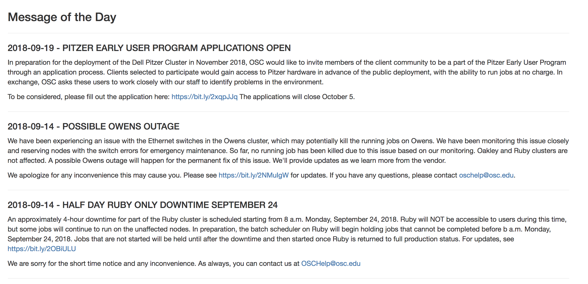

## Opening a Terminal

Connecting to an HPC system is most often done with a program known as "SSH" (**S**ecure **SH**ell) which is accessed through a Terminal. Linux and Mac users will find a Terminal program already installed on their computers.  Windows PC users will need to install a Terminal emulator, I suggest using PuTTY. If you haven't done so, please download the appropriate version for your [32bit](https://the.earth.li/~sgtatham/putty/latest/w32/putty.exe) or [64bit](https://the.earth.li/~sgtatham/putty/latest/w64/putty.exe) OS.

> ## 32 bit or 64 bit OS?
> Visit this [website](https://support.wdc.com/knowledgebase/answer.aspx?ID=9405) for instructions on determining if your Windows 7,8 or 10 is 32 or 64 bit.
{: .callout}

## Connecting with SSH

The SSH program needs atleast one parameter to connect to a remote server:

* **Server Address** The web address of the server to connect to

Additional parameters may also be necessary:

* **Port Number** The specific port used to connect to the server
* **User ID** Your user ID on the HPC system  

blankline
   

## Basic SSH Connection

Open your terminal, and input the following command.

~~~
ssh username@owens.osc.edu
~~~
{: .bash}

If you've never connected to this particular server before you'll encounter a message similar to this:

~~~
The authenticity of host 'owens.osc.edu' can't be established.
RSA key fingerprint is 2a:b6:f6:8d:9d:c2:f8:2b:8c:c5:03:06:a0:f8:59:12.
Are you sure you want to continue connecting (yes/no)?
~~~
{: .bash}

This is your computer warning you that you're about to connect to another computer, type \"yes\" to proceed.  This will add the HPC to your \"known hosts\", and you shouldn't see the message again the future.

~~~
Warning: Permanently added 'owens.osc.edu' (RSA) to the list of known hosts.
~~~~
{: .bash}

You should now be prompted to input your password.  Type it in carefully (no characters will appear on the screen), then press ENTER.

~~~
username@owens.osc.edu's password: 
~~~
{: .bash}

If you entered your password appropriately, congratulations, you're now connected to the HPC!  

blankline

## Connecting with our OnDemand web portal

It is important to know how to login with SSH since it is the traditional method and you may have to use it occasionally. 
But we don't have to use it exclusively anymore since OSC developed an open-source web portal, OnDemand.

OnDemand is our "one stop shop" for access to our High Performance Computing resources. With OnDemand, you can upload and 
download files, create, edit, submit, and monitor jobs, run GUI applications, and connect via SSH, all via a web broswer, 
with no client software to install and configure.

### Logging on to OnDemand

Open a new browser window and go to [https://ondemand.osc.edu](https://ondemand.osc.edu)

You'll see two different login options. Right now, we will just use our HPC username and password and log in directly.

The rest of the exercises we'll work on today will be with OnDemand.

>There is an introduction to OnDemand on OSC's website [osc.edu/ondemand](https://www.osc.edu/resources/online_portals/ondemand)
{: .callout}

Once you are logged in, you'll see the dashboard. At the top are the pulldown menus we'll use to access the clusters.

On the rest of the page, the Message of the Day (MOTD) is displayed. Always review this information because we post it 
so users know key changes to clusters and upcoming outages.

We'll open a shell tab under 'Clusters', select 'Owens shell access'.

> ## The Command Prompt
> The command prompt is the symbol or series of characters which precedes each shell command, and lets the user know the shell is ready to receive commands.  For example, when you initially login to the HPC your command prompt should resemble `-bash-4.1`. If your command prompt changes to `>`, the shell is expecting further input. Use the key-binding CTRL+C to escape shell commands, returning your prompt from `>` to `-bash-4.1`.  
>
> Let's all change our command prompts to something more useful, input the command `PS1='\W\n $ '`. Our command prompt is now our current working directory followed by a \"$\".
>
> Make sure you can copy and paste this command into the shell tab, that will make the rest of this workshop much easier.
{: .callout}

